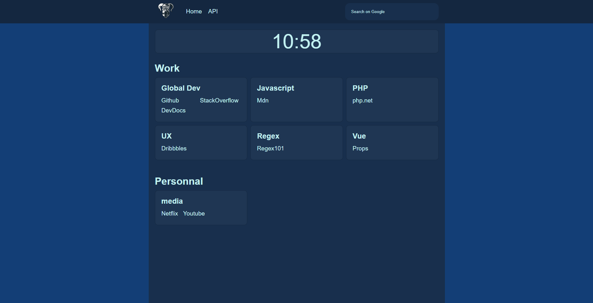
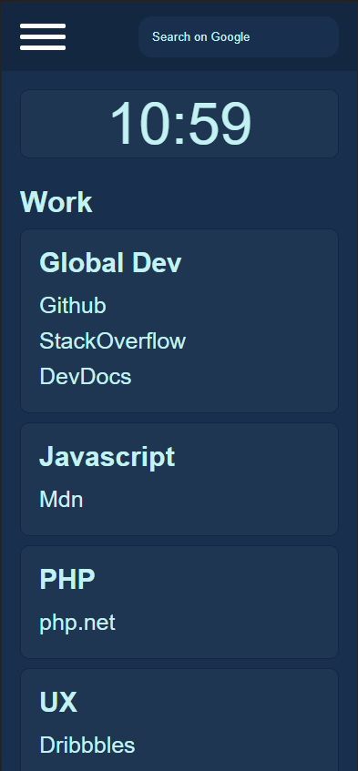

**Homepage** is a simple web application , it have to goal to be upgradable.

Currently the application is divide in two part , one is the front-end part and the other is the back-end part.

The front-end part is write in VueJS 3 and in SCSS , this part is currently responsive and use some api like cocktail api (https://www.thecocktaildb.com/api.php).

The back-end part is currently a API made with express in nodeJS and typescript.

If you want to start the front-part you need to do this.
```
# Download the dependances for VueJs 3 
npm run install


# Start the website in dev mode
npm run serve


# build the final version
npm run build

```



IF you want to start the back-end part you need to do this
```
# Download the dependances for Express and Typescript
npm run install


# Start the API in dev mode
npm run dev


# build the final version
npm run build

# run the final version 
npm run start
```